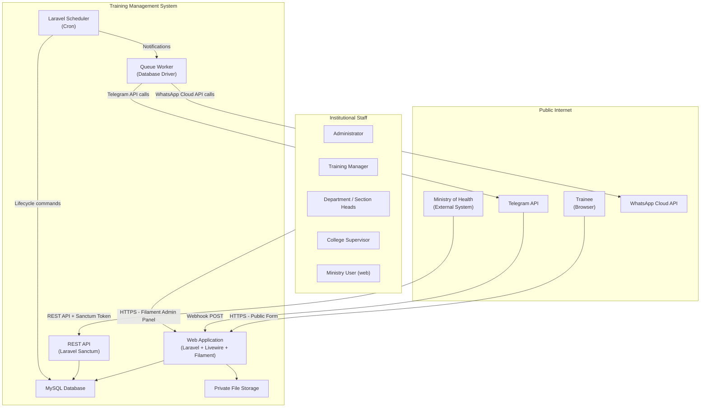
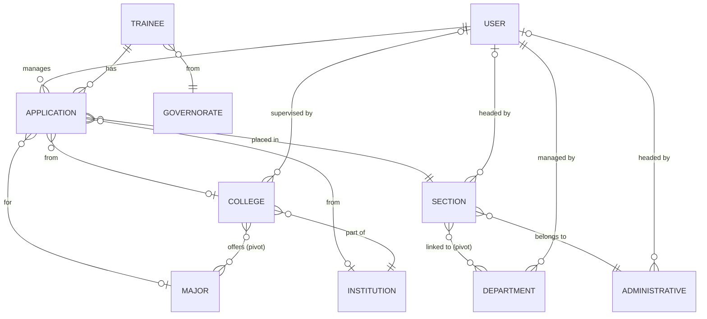
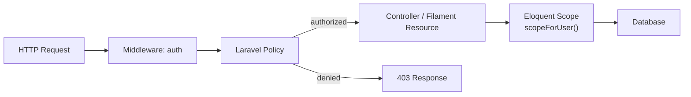

# Architecture — Training Management System

> This document describes the architecture of the training management system at a public-safe level. It is based on direct inspection of the production repository. All proprietary implementation details, infrastructure hostnames, and sensitive configurations are omitted.

---

## Architectural Style

The system follows a **monolithic server-side Laravel architecture** with distinct UI layers:

- **Server-rendered public UI** via Livewire (reactive, stateful Blade components)
- **Administrative UI** via Filament 4 (an administrative panel framework built on Livewire and Alpine.js)
- **REST API** for external machine-to-machine integration (Ministry of Health)
- **Webhook receivers** for external push integrations (Telegram, WhatsApp)
- **Queue workers** for asynchronous external-API calls
- **Scheduler** for time-driven automation

There is no frontend SPA. All rendering is server-driven. JavaScript is used only for UI interactions (Livewire reactivity, Filament components, minimal Vite-built assets).

---

## High-Level System Context



---

## Main Application Layers

### 1. Public UI Layer (Livewire)

The public-facing interface consists of two Livewire components:

- **`WelcomeForm`** — Landing page. Reads `TrainingSettings` to determine if the form is enabled and renders the introduction view.
- **`TraineeForm`** — Multi-step application form. Manages state for training type selection, eligibility checking, cascading location/section dropdowns, and submission. Delegates to `ApplicationStatusService` for eligibility and to `SubmitApplicationAction` for the actual submission.

Route protection: public routes are rate-limited (`throttle:60,1`). The form queries a runtime setting (`is_public_form_enabled`) before allowing submission.

### 2. Administrative Panel (Filament 4)

The Filament panel (`/home` prefix, confirmed from route analysis) provides the administrative interface for all staff roles.

**Resources (Filament CRUD modules):**

| Resource | Manages |
|----------|---------|
| ApplicationResource | Applications (create, view, edit, export, import) |
| TraineeResource | Trainee records |
| DepartmentResource | Departments |
| SectionResource | Sections (capacity, active status) |
| CollegeResource | Colleges and their application permissions |
| InstitutionResource | Institutions |
| AdministrativeResource | Administrative areas |
| UserResource | System users and role assignment |
| InboxResource / MailboxResource | Internal messaging |

**Pages:**

| Page | Purpose |
|------|---------|
| ManageTrainingSettings | Runtime operational settings (largest page, ~49KB) |
| Maintenance | Maintenance mode display page |
| ViewProfile | User profile management |
| ChangePhoneNumber | Phone number change flow |

**Widgets (Dashboard):**

| Widget | Shows |
|--------|-------|
| DashboardStatsOverview | Application counts by status |
| DepartmentTraineeCountWidget | Per-department trainee breakdown |
| GTMRecentApplications | Latest applications for training managers |
| CapacityOverviewWidget | Section capacity overview |
| AdministrativeCapacityOverview | Capacity by administrative area |
| CriticalCapacityWatchlist | Sections at or near capacity |
| StudentsFinishingSoonWidget | Trainees ending training soon |
| ExternalPartnerActiveTraineesWidget | Active trainees from external partners |
| GTMCapacityChart | Visual capacity chart |
| AdminLatestUsers | Recently added users (admin only) |

### 3. Application Layer (Actions and Services)

Business logic is separated from controllers and resources into:

**Actions:**

| Action | Responsibility |
|--------|---------------|
| `SubmitApplicationAction` | Validates capacity, creates trainee and application transactionally, handles file upload |
| `SyncMohApplicationAction` | Validates MOH API data, normalizes phone number, upserts trainee and application |

**Services:**

| Service | Responsibility |
|---------|---------------|
| `ApplicationStatusService` | Eligibility checking, cache management, re-application policy |
| `FormDataLoaderService` | Loads dropdown data for the public form |
| `TelegramMonitorService` | Sends Telegram messages, handles application event hooks |
| `WhatsAppNotificationService` | Formats and dispatches WhatsApp notification messages |
| `ExcelImportService` | Handles bulk application import from Excel |
| `AiTableSearchInterpreter` | AI-assisted table search (feature-flagged) |

### 4. Domain Models (Eloquent ORM)

Core entities and their relationships:



**Key model details:**

- `Application` — 10 status constants, 2 training type constants, Soft Deletes, Media Library, model event hooks for notifications and Telegram
- `User` — 10 role constants, Sanctum API tokens, Filament user contract, Impersonate trait, Soft Deletes
- `Section` — Capacity tracking, active/inactive flag
- `TelegramSubscriber` — Stores authorized bot subscribers with notification preferences
- `Mailbox` — Internal messaging between users

### 5. API Layer

A versioned REST API at `/api/v1`:

```
POST /api/v1/auth/login          → ApiAuthController (returns Sanctum token)
POST /api/v1/moh/applications    → MohApplicationController (Sanctum-protected)
                                   → SyncMohApplicationAction
```

The API is designed for machine-to-machine use (Ministry of Health system). No browser-facing API endpoints exist.

### 6. Queue and Background Processing

Queue driver: **database** (jobs stored in the `jobs` table).

**Queued jobs:**

| Job | Trigger | Purpose |
|-----|---------|---------|
| `SendWhatsAppMessageJob` | Application status change or scheduled command | Send WhatsApp notification to trainee via Cloud API |
| `DistributeMessageJob` | Internal | Distribute messages to multiple recipients |

The WhatsApp job applies a `RateLimited('whatsapp')` middleware and retries up to 3 times with a 60-second delay on failure.

### 7. Scheduler

The Laravel scheduler runs the following commands (configured in `app/Console/Kernel.php`):

| Command | Time | Description |
|---------|------|-------------|
| `app:start-waiting-applications` | Daily | Promote waiting-list applications when capacity is available |
| `app:end-training` | Daily 00:01 | Mark expired trainings as ended |
| `app:check-training-end-dates` | Daily 09:00 | Send WhatsApp end-date reminders |
| `telegram:daily-report` | Configurable | Send daily Telegram monitoring summary |
| `app:database-backup` | Daily 10:00 | Create PHP-native SQL backup |
| `app:clean-old-backups` | Every 10 days | Remove backup files older than 10 days |

An additional scheduled command in `routes/console.php` runs `app:start-waiting-applications` daily as well (overlapping schedule — the Kernel definition takes precedence).

### 8. External Integrations

**Telegram:**
- Webhook: `POST /telegram/webhook` → `TelegramWebhookController`
- Long-polling: `php artisan telegram:listen` (alternative to webhook)
- Outbound: `TelegramMonitorService` sends to configured chat IDs + active subscribers
- Log channel: `TelegramLoggerHandler` is registered in the `telegram` log channel (visible in `.env.example`)

**WhatsApp:**
- Verification: `GET /whatsapp/webhook` → `WhatsAppWebhookController::verify()`
- Incoming: `POST /whatsapp/webhook` → `WhatsAppWebhookController::handle()` (currently handles verification; outbound-only for notifications)
- Outbound: `SendWhatsAppMessageJob` → WhatsApp Cloud API (Meta Graph API v22.0)

### 9. File and Document Generation

**File uploads:**
- Application letter files stored on the `local` private disk via Spatie Media Library (`trainee_application_files` media collection)
- Secure download via authenticated route `GET /applications/{application}/download-trainee-files`

**PDF generation:**
- Absorption papers generated with Laravel mPDF
- Arabic/RTL configuration: `autoArabic`, `autoLangToFont`, `notonaskh` font
- Route: `GET /applications/{application}/absorption-paper` (policy-gated)

**Excel:**
- Export: Filament Export (PhpSpreadsheet) with custom styling (`StyleExportFile`)
- Import: `ImportApplicationsPage` with `ExcelImportService` and a downloadable import template via `ExcelTemplateController`

**Database backup:**
- PHP-native SQL dump via `BackupExport`
- Admin download: `GET /backup/download` (admin-only)
- Automated: daily scheduled command

### 10. Settings and Configuration

Runtime settings are managed via `spatie/laravel-settings` backed by the `settings` database table. The `TrainingSettings` class (group: `training`) exposes:

- Form availability (`is_public_form_enabled`)
- Enabled training types (`enable_training_type_practice`, `enable_training_type_university`)
- Re-application policies (`can_university_reapply`, `can_practice_reapply`)
- Maintenance mode (`is_maintenance_mode`, `maintenance_title`, `maintenance_message`, `maintenance_roles`)
- Section visibility for non-admin roles (`hide_full_sections`)
- WhatsApp notification toggles (per event type and per role)
- Telegram notification toggles
- Backup metadata (`last_backup_at`)
- AI search feature flag (`ai_search_enabled`, `ai_search_allowed_roles`)

All settings are editable from the `ManageTrainingSettings` Filament page without redeployment.

### 11. Authorization Architecture



- `AuthServiceProvider` registers all eight policy classes
- Each Filament resource applies the corresponding policy via `->authorizeWith()`
- `Application::scopeForUser()` enforces data-level visibility at the ORM layer
- Users not mapped to an organizational entity (department, section, etc.) receive an empty result set via `whereRaw('1 = 0')`

---

## Deployment Assumptions

Based on the repository configuration (`.env.example`, `Kernel.php`, `composer.json`):

- PHP 8.3+ runtime required
- MySQL 8+ database
- A cron job must call `php artisan schedule:run` at least every minute
- A queue worker must run `php artisan queue:work` (or `queue:listen`)
- The `local` and `public` filesystem disks must be configured and writable
- Telegram and WhatsApp credentials are provided via environment variables
- The application uses database sessions and database cache (no Redis required in base configuration)

> Note: Infrastructure-specific details such as hostnames, server configurations, deployment scripts, and environment-specific secrets are not included in this public case study.