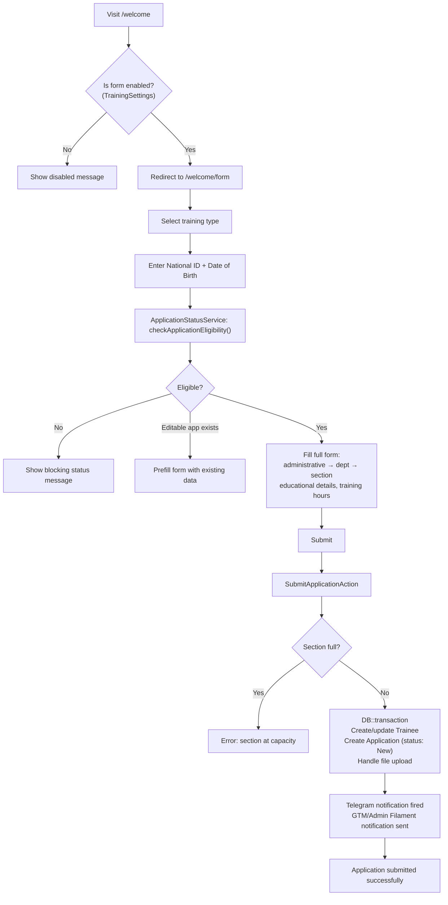
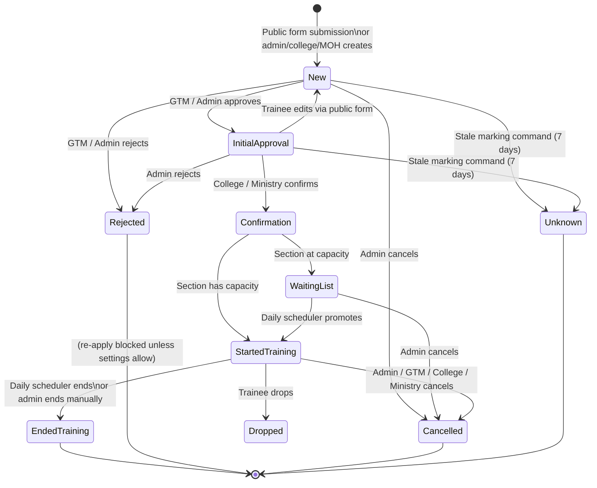
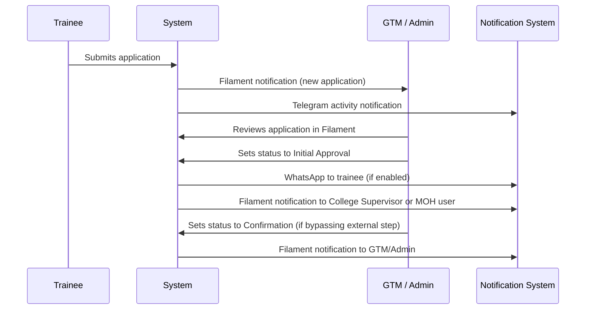
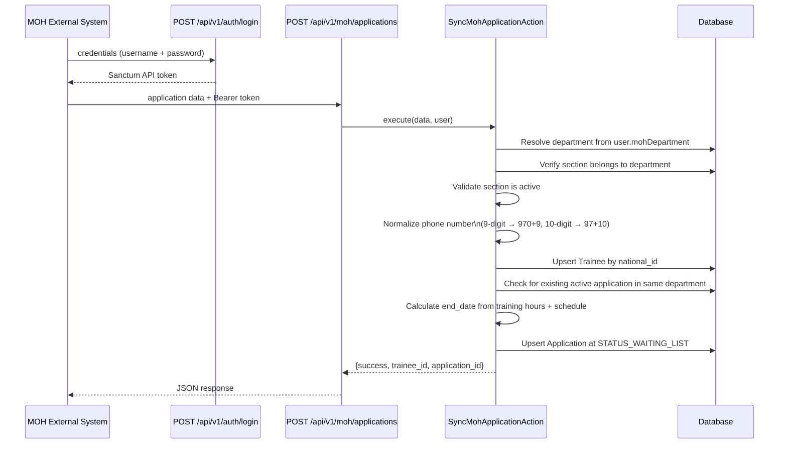
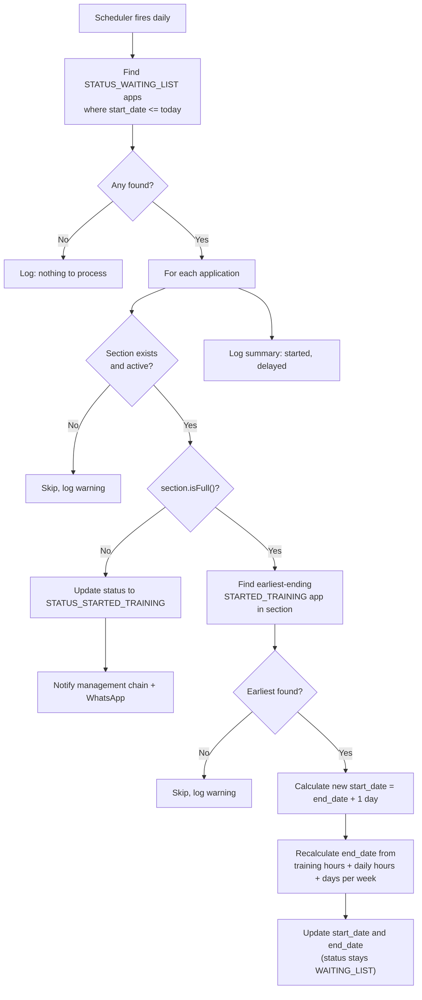
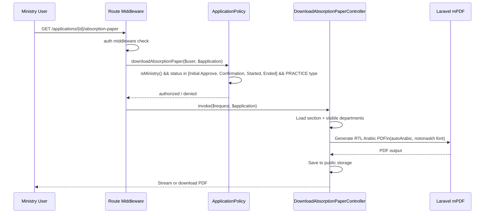
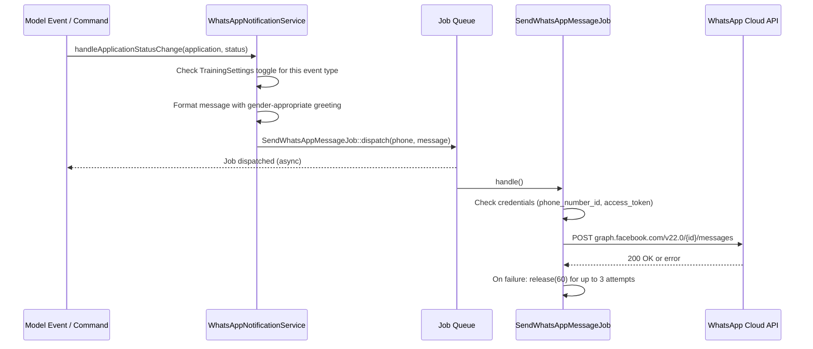

# Workflows — Training Management System

> This document describes the main verified workflows of the training management system. All workflows are derived from direct code inspection. Only confirmed implemented behavior is described.

---

## Workflow Index

1. [Public Trainee Application](#1-public-trainee-application)
2. [Eligibility and Duplicate Checking](#2-eligibility-and-duplicate-checking)
3. [Application Status Lifecycle](#3-application-status-lifecycle)
4. [Administrative Review Workflow](#4-administrative-review-workflow)
5. [External Partner Confirmation](#5-external-partner-confirmation)
6. [Ministry of Health API Synchronization](#6-ministry-of-health-api-synchronization)
7. [Waiting List Promotion (Automated)](#7-waiting-list-promotion-automated)
8. [Training End Detection (Automated)](#8-training-end-detection-automated)
9. [End-of-Training Reminder (Automated)](#9-end-of-training-reminder-automated)
10. [Stale Application Marking (Automated)](#10-stale-application-marking-automated)
11. [Secure Document Download (PDF)](#11-secure-document-download-pdf)
12. [Database Backup and Cleanup](#12-database-backup-and-cleanup)
13. [WhatsApp Notification Delivery](#13-whatsapp-notification-delivery)
14. [Telegram Monitoring Bot](#14-telegram-monitoring-bot)

---

## 1. Public Trainee Application

**Purpose:** Allow eligible trainees to submit a training application without an account.

**Actors:** Trainee (unauthenticated public user)

**Trigger:** Trainee visits `/welcome` and starts the form

**Main Steps:**

**Important validations:**
- Form must be enabled in `TrainingSettings::is_public_form_enabled`
- National ID must be 9 characters
- Date of birth must match existing trainee record (if any)
- Selected section must not be at capacity
- Re-application policy is enforced per training type

**Status transition:** Application created at `STATUS_NEW` (1)

**Failure behavior:**
- Form disabled: shows maintenance-style message from settings
- Section full: exception thrown, form shows error
- Database failure: transaction rolled back, no partial records created

---

## 2. Eligibility and Duplicate Checking

**Purpose:** Prevent duplicate or ineligible applications before the full form is presented.

**Actors:** Trainee (public), ApplicationStatusService

**Trigger:** Trainee submits national ID and date of birth on the first step of the form

**Main Steps:**

1. If national ID length ≠ 9: return ineligible immediately
2. Check cache for a recent result (5-minute TTL)
3. Query `Trainee` by `national_id`
4. If trainee not found: return `can_apply = true` (first-time applicant)
5. If found: verify `dob` matches — mismatch returns ineligible
6. **Global check:** Query for any active application (statuses other than Ended, Rejected, Cancelled)
   - If active application is in editable status (New, Initial Approval): return `has_application = true, is_new_application = true` with prefill data
   - If active application is in non-editable status: return `can_apply = false` with status message
7. **Type-specific check:** If re-application is not allowed (per settings), check for terminal applications (Rejected, Cancelled) of the same type
8. If no blocking application found: return `can_apply = true` with trainee prefill data

**Cache:** Results are cached for 5 minutes per `{nationalId}:{trainingType}:{dob}:{canReapply}` key. Cache is invalidated on application status change.

**Failure behavior:** Any unexpected error returns ineligible to prevent partial state exposure.

---

## 3. Application Status Lifecycle

**Purpose:** Define the complete set of statuses and the valid transitions for an application.

**Status Map:**

**Notification triggers on status change:**
- `STATUS_INITIAL_APPROVE` → WhatsApp to trainee (if enabled); Filament notification to MOH or College + Admin/GTM
- `STATUS_CONFIRMATION` → Filament notification to Admin/GTM
- `STATUS_STARTED_TRAINING` → WhatsApp to trainee (if enabled); Filament notification to full management chain
- `STATUS_ENDED_TRAINING` → WhatsApp to trainee (if enabled); Filament notification to full management chain

---

## 4. Administrative Review Workflow

**Purpose:** Allow authorized staff to review new applications and move them through the lifecycle.

**Actors:** System Administrator, General Training Manager (GTM), Assistant Training Manager (ATM)

**Trigger:** New application appears in Filament application list

**Main Steps:**

**ATM restrictions:**
- ATM can only manage applications within their assigned departments
- The `canManageApplication()` check verifies department intersection

**Failure/fallback:**
- If a user is not linked to an active section/department/administrative, `scopeForUser()` returns an empty set and the user sees no records

---

## 5. External Partner Confirmation

**Purpose:** Allow College Supervisors and Ministry users to confirm applications assigned to them.

**Actors:** College Supervisor (university-type), Ministry of Health user (practice-type)

**Trigger:** Application reaches `STATUS_INITIAL_APPROVE`; external partner is notified via Filament notification

**College Supervisor flow:**
1. College Supervisor logs in to Filament panel
2. Sees only university-type applications from their institution
3. Can view and update applications in statuses: New, Initial Approval, Confirmation
4. Confirms application → status moves to Confirmation

**Ministry of Health (web) flow:**
1. Ministry user logs in to Filament panel
2. Sees only practice-type applications (optionally scoped to their linked department)
3. Can create new applications, view, and update existing ones
4. Confirms application → status moves to Confirmation
5. Can download absorption paper PDF for confirmed practice applications

**Important validations:**
- `ApplicationPolicy::create()` checks that the college has `add_application` enabled and the institution has `add_application` enabled before allowing College Supervisors to create applications
- Ministry users cannot see university-type applications

---

## 6. Ministry of Health API Synchronization

**Purpose:** Accept training placement data submitted by the Ministry of Health's external system and create or update local records.

**Actors:** Ministry of Health external system (API client)

**Trigger:** Ministry system sends `POST /api/v1/moh/applications` with a valid Sanctum token

**Main Steps:**

**Important validations:**
- User must have a linked MOH department (`mohDepartment` relationship)
- Section must belong to the MOH user's department
- Section must be active
- Capacity check is intentionally bypassed for MOH-sourced applications (documented in code)

**Failure behavior:**
- Missing department link → 403 response
- Invalid or non-owned section → 403 response
- Inactive section → 403 response
- Any exception → 500 response with generic error message; exception logged

---

## 7. Waiting List Promotion (Automated)

**Purpose:** Automatically promote waiting-list applications to active training when section capacity becomes available.

**Actors:** Laravel Scheduler, `StartWaitingApplicationsCommand`

**Trigger:** Daily schedule

**Main Steps:**

**Failure behavior:**
- Missing or inactive section: application is skipped and a warning is logged
- No earliest application found (unexpected): skipped with warning
- Status change triggers the standard notification chain

---

## 8. Training End Detection (Automated)

**Purpose:** Automatically mark applications as ended when their end date has passed.

**Actors:** Laravel Scheduler, `EndTrainingCommand`

**Trigger:** Daily at 00:01

**Main Steps:**

1. Query `STATUS_STARTED_TRAINING` applications with `end_date < today`
2. Update status to `STATUS_ENDED_TRAINING`
3. Model event fires WhatsApp notification (if enabled) and Filament notification to management chain

**Failure behavior:** Status change is wrapped in model events; Telegram/WhatsApp failures are caught and logged, not re-thrown.

---

## 9. End-of-Training Reminder (Automated)

**Purpose:** Notify trainees via WhatsApp a configurable number of days before their training ends.

**Actors:** Laravel Scheduler, `CheckTrainingEndDatesCommand`

**Trigger:** Daily at 09:00

**Main Steps:**

1. Check `TrainingSettings::whatsapp_end_training` — if false, stop immediately
2. Read `TrainingSettings::whatsapp_end_training_days` (configurable days-before reminder)
3. Calculate `targetDate = today + days`
4. Query `STATUS_STARTED_TRAINING` applications with `end_date = targetDate`
5. For each, construct a reminder message and call `WhatsAppNotificationService::sendMessage()`
6. Message dispatched to queue via `SendWhatsAppMessageJob`

**Failure behavior:** If trainee has no phone number, the application is skipped silently.

---

## 10. Stale Application Marking (Automated)

**Purpose:** Prevent indefinitely pending applications from occupying eligibility slots.

**Actors:** Laravel Scheduler, `MarkStaleApplicationsUnknown`

**Trigger:** Daily at 02:00

**Main Steps:**

1. Find applications in non-terminal statuses (New, Initial Approval) not updated for 7+ days
2. Update status to `STATUS_UNKNOWN`
3. Trainee is no longer blocked from reapplying (depending on settings)

---

## 11. Secure Document Download (PDF)

**Purpose:** Allow authorized Ministry users to download an official absorption paper PDF for a confirmed practice application.

**Actors:** Ministry of Health user (web)

**Trigger:** Authorized user requests `GET /applications/{application}/absorption-paper`

**Main Steps:**

**Failure behavior:**
- Unauthorized role or status: Laravel 403 abort via policy
- PDF save failure: logged but PDF is still streamed

---

## 12. Database Backup and Cleanup

**Purpose:** Maintain automated daily SQL backups without requiring external binary tools.

**Actors:** Laravel Scheduler, `DatabaseBackupCommand`, `CleanOldBackupsCommand`

**Trigger:** Daily at 10:00 (backup); every 10 days at 10:15 (cleanup)

**Backup steps:**
1. `DatabaseBackupCommand` instantiates `BackupExport`
2. `BackupExport` queries each table via PHP/PDO and generates `INSERT` SQL statements
3. SQL dump is stored on the private disk at `backups/backup_{dbname}_{datetime}.sql`
4. Admin can download the latest backup via `GET /backup/download` (admin-only route)

**Cleanup steps:**
1. `CleanOldBackupsCommand` lists files in `private://backups/`
2. Parses date from filename (format: `backup_{dbname}_YYYY-MM-DD_HH-mm-ss.sql`)
3. Deletes files older than the configured retention period (default: 10 days)
4. `.gitkeep` files are skipped

**Failure behavior:** Both commands catch exceptions, log errors, and return without throwing, so a backup failure does not crash the scheduler.

---

## 13. WhatsApp Notification Delivery

**Purpose:** Deliver status-change notifications to trainees via the WhatsApp Cloud API.

**Actors:** Application model events, `CheckTrainingEndDatesCommand`, `WhatsAppNotificationService`, `SendWhatsAppMessageJob`

**Trigger:** Application status changes to Initial Approval, Started Training, or Ended Training; or scheduled end-date reminder

**Delivery flow:**

**Rate limiting:** `RateLimited('whatsapp')` middleware applied to the job.

**Failure behavior:** Job retries up to 3 times with 60-second delay. After 3 failures, job is marked as failed. All failures logged.

---

## 14. Telegram Monitoring Bot

**Purpose:** Allow authorized operators to monitor the system in real time via Telegram.

**Actors:** Authorized Telegram subscribers, `TelegramWebhookController`, `TelegramMonitorService`

**Two operating modes:** HTTP webhook (production) or long-polling Artisan command (development/alternative)

**Authentication flow:**
1. User sends `/start` to bot
2. If chat ID is in admin config list: auto-authorized
3. Otherwise: user must send `/auth <access_code>`
4. On correct code: subscriber marked active in database
5. All commands blocked for inactive subscribers

**Available commands (for authorized subscribers):**

| Command | Action |
|---------|--------|
| `/start` | Welcome message; prompts auth if needed |
| `/auth <code>` | Authenticate subscriber |
| `/help` | List available commands |
| `/summary` | Live stats: today's applications, sessions, errors |
| `/report` | Trigger daily report immediately |
| `/find <id>` | Look up application by ID |
| `/status_on` | Enable activity notifications for this subscriber |
| `/status_off` | Disable activity notifications |
| `/errors_on` | Enable error log notifications |
| `/errors_off` | Disable error log notifications |
| `/users` | List active subscribers (with their preferences) |

**Outbound notifications (sent automatically):**
- New application created
- Application status changed
- Application deleted or restored
- Daily summary report (scheduled)
- Error logs (via `TelegramLoggerHandler` in the Laravel log stack)

**Failure behavior:** All Telegram calls are wrapped in try/catch. Failures do not interrupt the application lifecycle. Errors are logged locally.